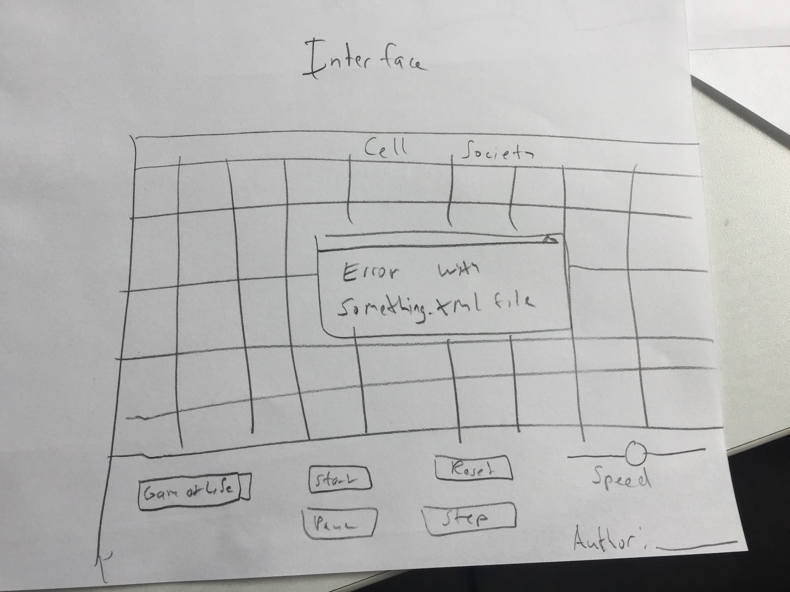

CELL SOCIETY
==================

## Introduction

### Describe problem

Cellular Automata simulation may have an arbitrary number of states for each of its cells, and each cell's state and position influences how the next grid will look. There will be multiple simulations with different rules that the program may be required to run. At a high level, a screen creates the UI and 2d display for the society. The initial conditions for the screen are read by xml files and then the UI is used to change the display. There are rules that the cell society follows that update the display.

### Primary design goals

Our primary design goals are to make the implementation flexible such that adding new CA simulations and features can be done with minimal change in code. We also want to allow the reuse of rules in different simulations to avoid the repetition of the code for each rule.

### Primary architecture of design:

An XML file will define which rules are used in a simulation, as well as initial conditions for the grid, and other important parameters used throughout it. The rules and methods for a specific simulation are defined in a database of rules that is referenced in order to update the cells, every time there is a new turn. The rule database is open as it is the most reasonable way to create new simulation rulesets in our design structure. Even in the case of the rules database, methods should only be added and not deleted. The XML files are meant to be used to change some initial conditions like ratios/some rule parameters/initial conditions. Everything else is meant to be closed for the purposes of adding new simulations/editing initial conditions. 

## Overview

The program design has eight major classes: CellSociety, Screen, SimulationLoader, CellSimulator, SimulationInterface, Grid, Cell, and Rules. CellSociety initializes the program by creating an ArrayList of SimulationLoader objects that each read in the information for a particular simulation from its XML file. It then passes this to SimulationInterface through the Screen class, the latter of which will handle both displaying the simulation and the user interface in the stage. The SimulationInterface object will represent the options available to the user, including the speed and playback of the simulation as well as the choice of which simulation to run. It passes this information (along with only the currently chosen SimulationLoader object) to a CellSimulator. This object controls the flow of turns in the game by creating and updating a Grid object as specified by the SimulationInterface (60 times per second, once per method call, etc). The Grid object handles updating by going through every cell and passing it to the right static methods in the Rules class that write the resulting state to a new grid, which Grid eventually makes the current grid after all updating is finished. The Grid knows which rules are the correct ones because they are specified by the SimulationLoader class, which represents the correct simulation. The Cell class contains the state of a particular cell, along with methods that change the state as needed. The Rules class is not instantiatable; rather, it contains a database of static methods that take a Cell and its neighbors as parameters and apply logic to return the result. 

Picture form of some information about the classes:

For more specifics like method names, check out design details.

## User Interface

The current interface is very simply designed as there is the basic plan contains 1 screen. There is a game window with the actual cell simulation display on the top and some modifiable elements on the bottom. These elements currently include a drop down menu for the different types of simulations available, a slider that controls the speed of the simulation, and buttons to control start, pause, reset, and step. There is also text that displays the author's name in the bottom right corner. If there are errors reading the XML files, there will be an alert that pops up saying there was an error reading the file and will attempt to display the working XMLs. Users also interact with the program by editing the XML files. There will also be an error window that is displayed for if there are any issues reading the files like bad input, unreasonable dimensions, 

## Design Details 

CellSociety: CellSociety class is responsible for having a main() method that starts the program. The start method will create the screen window from an instance of the Screen class, as well as creating an ArrayList of SimulationLoader objects each of which contains relevant information about the different simulations. This relevant information in each SimulationLoader class is passed from an XML file, which will be encoded to be able to interact and be read by the SimulationLoader class. This class most likely wouldn't change much if we were given any additional requirements, as it is simply responsible for doing things that are very basic to all CellSociety simulations.

Summary of class:
* start() method
* Make screen
* Read XML in simulationloader objects
* Make arraylist of simulation loaders objects

Screen: Screen class is responsible for having a method to create the window where the world display will be in, to create the actual world display, as well as all the sliders and parameters that define the simulation. The Screen class will pass in and receive information from the simulation interface class, which will define how exactly these parameters, as well as the grid arrangements and updates, will work in relation to every time the simulation runs and updates. If we were given additional requirements, most likely we'd have to change the way the screen looks (say, if an additional simulation requires different parameters to be included in a simulation) as well as potentially having different ways that the user can interact with the simulation (i.e. perhaps the user could click on the grid to specify initial conditions, amongst other things). These potential additions could be implemented by adding variables or methods in the makeScreen class to handle any additional features, as well as adding a method or class to enable the user to interact with the GUI with clicks on it.

* Summary of class:
* updateWorld() method
* Re-paint the screen with new grid's information
* updateSimulationType() method
* Re-paint the screen with a new type of simulation and its initial conditions
* initializeSimulation()
* Given initial conditions and parameters, setup the world screen with the initial conditions, grid, cells and parameters for a given specific type of simulation
* makeScreen()
* Creates the window and screen with all components that are used in the simulation, and sets up connections with the back end of the screen, SimulationInterface.
* currentSimulation variable
* SimulationLoader type variable that holds the current simulation's equivalent object type such that the Screen can read all the XML information that has been passed into it and use that to write stuff on the screen.

XML: The XML component of the project will likely be a file that includes all the different simulation parameters, as well as initial conditions, that will be read by the SimulationLoader class responsible for extracting all these parameter informations in a meaningful way, to be passed on to the rest of the program. The database of rules will depend on information that is passed on by the XML file, so it is important for the database and the XML file to communicate effortlessly. If any additional components are added to the project, the way to go about it would be to change the XML file in ways such that the new components and/or simulations can be represented and read by the rest of the program.

Summary of file:
* Include information about simulation name and author
* Include information about initial conditions
* Include information about parameters for each simulation

SimulationLoader: SimulationLoader class is responsible for reading in an XML file that contains important information as to how the current type of simulation of CellSociety will run. It will then store this information in a comprehensible format such that it can be passed onto and read by CellSimulator, Grid and maybe Screen. If additional components are added to the project, SimulationLoader will most likely have to add different methods and variables to be able to hold this information, and pass it on to the relevant classes that have dependencies on the new features.

Summary of class:
* readXML()
* Reads an XML file and assigns all relevant variables and methods with information pertaining to that particular simulation (i.e. simulation type, initial conditions, simulation parameters);
* initialConditions variable
* Grid object or matrix object with details about the initial conditions of the grid for the simulation
* Parameters variable
* Different sets of variables relevant for each simulation

CellSimulator: CellSimulator essentially creates the Grid (essentially a 2D array of Cell shapes) by populating the Screen Class and passes information from the XML files to the cells using a list of SimulationLoaders, which stores information about the initial conditions. It’s main purpose is to be the container of the grid and to maintain the grid independent from many of the other factors of the program. The simulator will be the point of contact for the SimulationInterface as well. Information is extracted from the interface and relayed to the Grid as necessary. If you wanted to create multiple CellSimulator on the same screen, you could create multiple instances of the CellSimulator class and populate it with different grid simulations. 

Summary of Class:
* The CellSimulator would help create the cells in the actual displayed Grid and provide Grid with necessary information from XML files and Interface. setGrid()
* Responsible for updating hosting timeline and updating Grid. update()
* Allows Grid to function independently in respect to many of other elements of the program as the Grid only requires the information it receives from CellSimulator. We want this to keep the program reasonably versatile.

SimulatorInterface: SimulatorInterface acts as the main point of contact between the user and the inputs of the game. It is created by the Screen and takes up the lower section of the window. It will accomplish the goals of the user interface by allowing the user to switch simulations (drop down menu), edit state with pause/stop/start/step (buttons), and alter speed (slider). This class will be the gateway to add more user editable elements for the grid. You will get information here and send it to the CellSimulator to handle what must be done to commit the actual change to the simulation. This new information can be gathered in any way that you want, as long as the Simulator is ready to handle it. To make it extendable, we envision adding new sliders and we would also have to change CellSimulator to make sure we could support the new change.

Summary of Class:
* SimulatorInterface handles getting information from the user and sending it to the simulator where it creates the necessary change. setGUI()
* Creates separation between the actual Simulation and editable elements to maintain modularity. getInputs()
Grid: The Grid class keeps track of the two-dimensional Cell array and is in charge of updating the simulation turn by turn. It does this by creating a new grid object and marking the effects of the rules on each cell in the old grid on it. After all the changes have been marked, it makes the new grid the current one and removes the old one. 
Summary of Class:
* update()
* Creates a new Grid and runs the rules specified by SimulationLoader in the Rules class on the current grid of cells, and writes the updated positions onto the new grid. Saves the new grid as the current grid.
* setRules(int[] rules)
* Sets the rules (and the order) with which to pass the current grid in order to create the new grid. Each rule is specified by a number from 1 to the number of rules, and the order is specified by that number’s index in the array.
Cell: The Cell class represents a single cell in the Grid. It holds a single state that can be changed, as well as an arbitrary number of numbers available for rules to use to track data over time. It has a color for each state, as specified by the SimulationLoader (although grid tells the cell what states map to what colors, not the actual SimulationLoader). 
Summary of Class:
* setState(int state)
* Updates the state and color of the cell to the specified state. Possible states are held in a list contained by the cell’s grid, and the grid calls this method on every cell for every new turn.
Rules: Rules contains a large list of possible rules with parameters for simulations to use. Each rule is static and takes in one cell and an array of its neighbors. Each rule is defined by a distinct number, which the Rules class uses to call it via a switch statement. A simulation can customize the rules it uses through parameters specified in the XML file and provided by the SimulationLoader.
Summary of Class:
* callRule(int rule, Cell cell, Cell[] neighbors)
* Uses a switch statement to call the specified rule and pass along the cell and its neighbors to apply the rule to. 
* setParameter(int rule, double parameter)
* Stores a simulation’s desired parameter for a particular rule internally. For example, the rule onFewerNeighbors() would have a parameter n defining that the rule will be applied when the cell has fewe than n neighbors.

Use Cases:
* Apply the rules to a middle cell: set the next state of a cell to dead by counting its number of neighbors using the Game of Life rules for a cell in the middle (i.e., with all its neighbors): the classes responsible for doing so will be Grid, Rules and Cell.
* Apply the rules to an edge cell: set the next state of a cell to live by counting its number of neighbors using the Game of Life rules for a cell on the edge (i.e., with some of its neighbors missing): the classes responsible for this functionality will be Rules, Grid and Cell.
* Move to the next generation: update all cells in a simulation from their current state to their next state and display the result graphically: the classes mainly responsible for this will be Rules, Grid and Cell.
* Set a simulation parameter: set the value of a parameter, probCatch, for a simulation, Fire, based on the value given in an XML fire: the class in charge of reading the XML file parameters will be SimulationLoader, which then will update the necessary variables to reflect whatever parameters have been passed in; the other classes that have dependencies on it will then use those new values to run the simulation as necessary.
* Switch simulations: use the GUI to change the current simulation from Game of Life to Wator: the classes involved in switching simulations will be the Screen, as well as the SimulationInterace; those will primarily receive information that the simulation is being changed by the user in the GUI, and thus update the GUI, update the current parameters that will be used for the simulation, and lastly, read information from SimulationLoader about the new different simulation that has been passed in.

## Design Considerations 

#### Issue 1: XML Mapping

An important design issue to be considered is how the XML file will provide useful information to be used in the simulation. The simulation depends on rules to update the cells in the grid, and there are several ways such that this can be structured.

One way would be to have the XML file provide the exact mapping from different states, as a function of neighbors (and any additional parameters particular to one of the simulations). The code would then interpret these mappings as rules, and use it to govern the way that the grid updates the cell states within it.

The pro advantage of this would be having the design be more flexible, as the rules and mappings from states to behaviors would be coming directly from the XML file, whereas the con disadvantage would be that it may be difficult to find an all encompassing way to represent all kinds of mappings in the XML file.

Another way would be to have the XML provide information as to what simulation is being played, and based on that, have the CellSimulator interact with a database of rules that govern the general simulation and updating of the cells in the grid every step that occurs.

The pro advantage of this would be that it is somewhat easier to implement as most of the rules will be available in the database, whereas the con disadvantage is that it makes it such that rules must be added to the database rule class every time a new simulation type is added.

#### Issue 2: Rules database vs. Abstract Class

Another important design consideration is the regarding how the rules will be read by the Grid class.

One option would be to have the rules database include all possible rules that can be chosen from a cell to be updated, given the current state of the grid.

The pro advantage is that all rules will be included in one place, whereas the disadvantage is that the rules class could become somewhat long.

Alternatively, there could be an abstract class for the Cell and/or Grid which has basic functionalities of every cell and grid, and for each particular simulation, extends this abstract class, and then implements the individual rules of how the cells and grid are updated inside each cell class.

The pro advantage is that all the rules for a particular simulation would live inside the cell and grid class versions of a simulation that extends an abstract class, thus not having any dependency with any additional classes, and the disadvantage would be that one or two (cell and grid) classes would have to be implemented every time a new type of simulation were to be added.

## Team Responsibilities

The responsibilities will be split up by classes, and have each team member complete each class based on the functionality required. The higher level functions of each team member will mostly be XML / GUI, Front End and Back End. The implementation of each class will be mindful of the existing dependencies between them such that they can exchange the required information between each other and also so that the team members can complete them by working at the same time and eventually combining all of them together.

Paulo: [XML/GUI] CellSociety, SimulationLoader, Screen, XML
Simran: [Front End] CellSimulator, SimulatorInterface
Brian: [Back End] Grid, Rules, Cell

